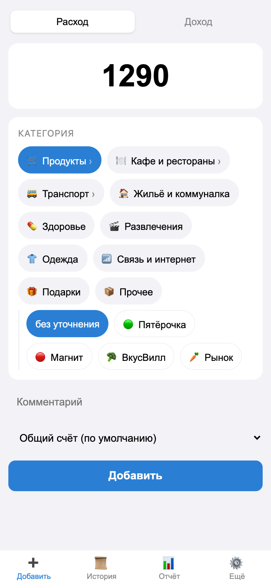
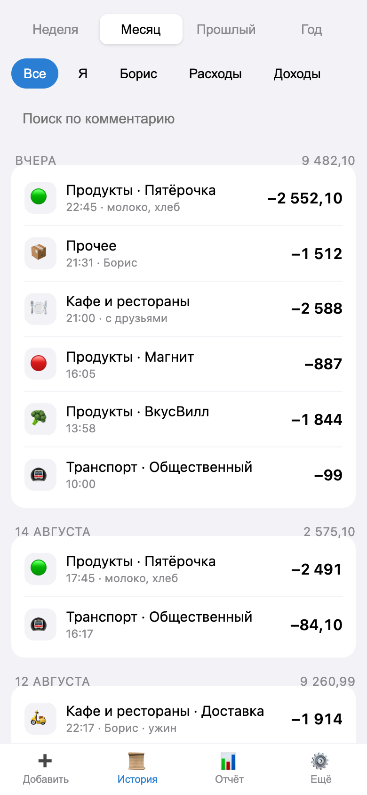
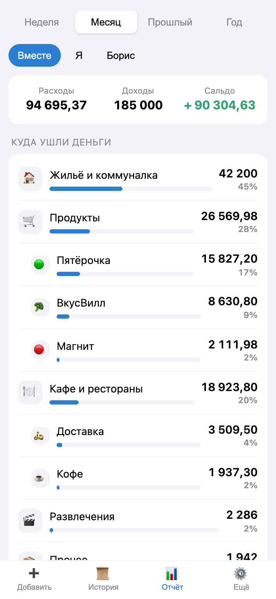
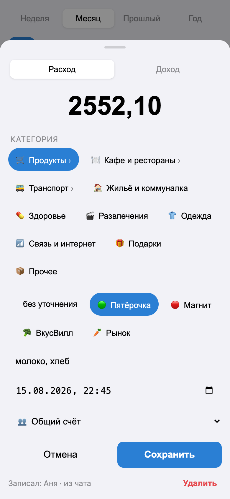
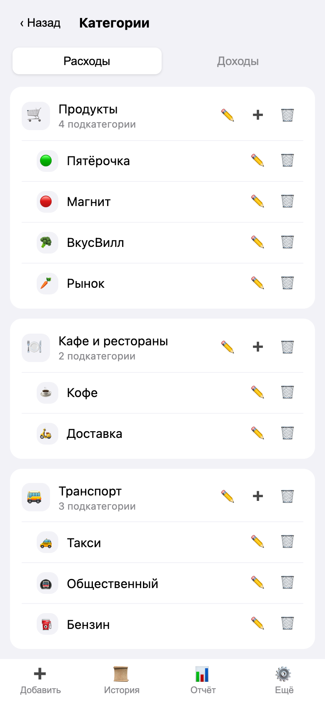
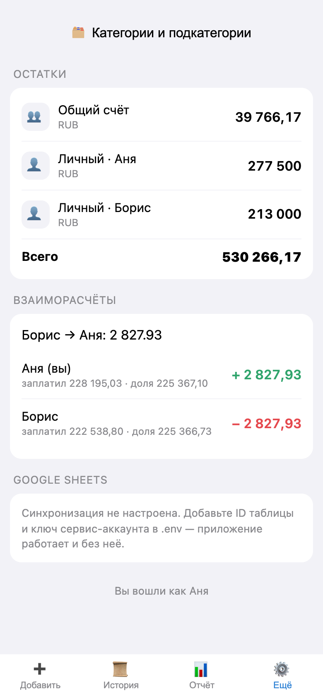
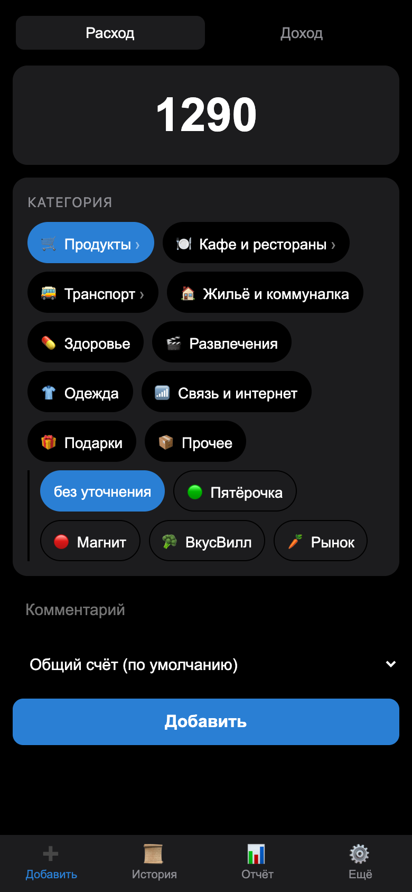
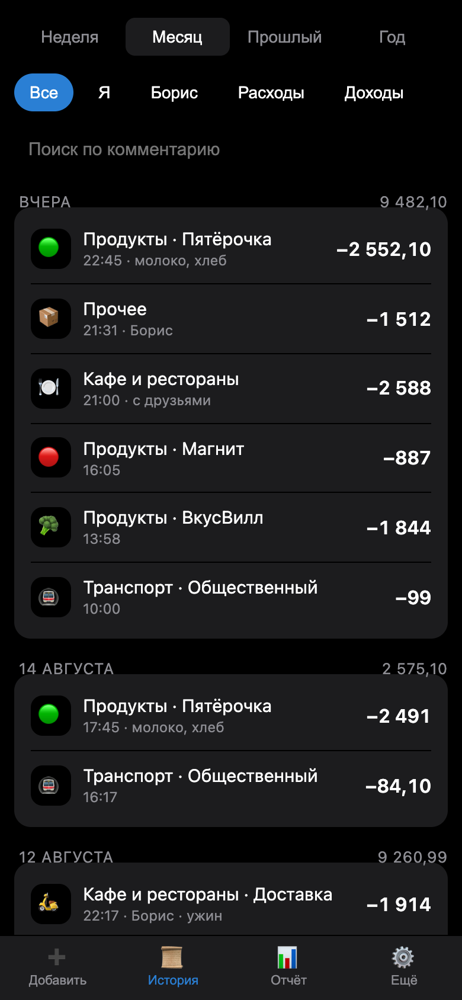
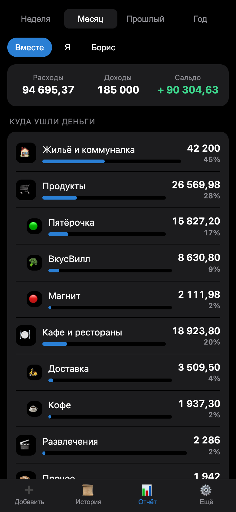

# FinanceTgApp

Telegram Mini App для совместного учёта финансов на двоих. SQLite — источник правды,
Google Sheets — двустороннее зеркало. Всё приложение — два контейнера и ~200 МБ памяти.

Обоснование архитектуры и разбор альтернатив: [docs/00-research-and-stack.md](docs/00-research-and-stack.md).

## Как это выглядит

| Добавить трату | История | Отчёт |
|:---:|:---:|:---:|
|  |  |  |
| Категория выбирается в два касания: ветка, потом уточнение | Группировка по дням, итог за день, кто записал | Родитель показывает сумму вместе с подкатегориями |

| Правка записи | Справочник категорий | Счета и расчёты |
|:---:|:---:|:---:|
|  |  |  |
| Любое поле уже записанной операции | Создать, переименовать, сменить значок | Кто кому должен и выгрузка в Sheets |

<details>
<summary>Тёмная тема</summary>

| | | |
|:---:|:---:|:---:|
|  |  |  |

Палитра берётся из Telegram: приложение подхватывает тему клиента, отдельной настройки нет.

</details>

## Демо за одну команду

Посмотреть, ничего не настраивая, — без бота, токенов и Telegram:

```bash
make setup   # один раз: зависимости бэкенда и фронта
make demo
```

Откроется <http://localhost:8000> с готовым журналом: два участника, три месяца трат,
около 275 операций, зарплаты, переводы в общий котёл и накопившийся долг одного другому.
Данные детерминированные — у всех демо выглядит одинаково.

Если Python и Node ставить не хочется:

```bash
make demo-docker
```

Демо живёт в отдельной базе `data/demo.db` и не трогает рабочую. Вход в нём открыт
без Telegram (`DEV_AUTH_BYPASS`), поэтому наружу его выставлять нельзя — только локально.

## Что уже работает

- **Mini App**: добавление расходов и доходов в три касания, история с группировкой по дням,
  отчёт по категориям и участникам, остатки по счетам, взаиморасчёты.
- **Категории и подкатегории**: «Продукты → Пятёрочка, Магнит». Дерево на два уровня,
  у каждой ветки свой значок и название; правятся прямо в приложении.
- **Правка истории**: любую запись можно открыть и изменить — сумму, дату, тип,
  категорию, счёт, комментарий.
- **Фильтры**: история и отчёт разбираются по людям, типу операции и категории;
  выбранная категория тянет за собой свои подкатегории.
- **Бот**: быстрый ввод одной строкой (`500 пятёрочка`), `/month`, `/balance`, `/settle`,
  `/llm`, `/sync`, кнопки «сменить категорию» и «удалить» под каждой записью.
- **Общий счёт**: траты с него автоматически делятся поровну, приложение считает,
  кто кому должен, и учитывает переводы-погашения.
- **Google Sheets**: выгрузка через outbox и импорт правок, сделанных руками в таблице.
- **Выгрузка для LLM**: `/api/export/llm` — компактные агрегаты вместо сырого журнала.

## Стек

| Слой | Технологии |
|---|---|
| Бэкенд | Python 3.12, FastAPI, aiogram 3, SQLAlchemy 2 + Alembic, APScheduler |
| База | SQLite (WAL). Переезд на Postgres — смена `DATABASE_URL` |
| Фронт | React 18 + TypeScript + Vite, TanStack Query, ~67 КБ gzip |
| Инфра | Docker Compose: приложение + Caddy (авто-TLS) |

Бот и API живут в одном процессе: одна кодовая база, один контейнер, общая транзакция БД.

## Быстрый старт (локально)

```bash
cp .env.example .env   # заполните BOT_TOKEN и ALLOWED_TELEGRAM_IDS
make setup
make migrate
make api                # бэкенд + бот в режиме polling
make web                # в другом терминале: фронт на localhost:5173
```

Mini App нельзя открыть по `http://localhost` внутри Telegram — нужен HTTPS-адрес.
Для локальной отладки поднимите туннель и укажите его в BotFather:

```bash
cloudflared tunnel --url http://localhost:5173
```

Чтобы открыть интерфейс в обычном браузере без Telegram, поставьте `DEV_AUTH_BYPASS=true`
и `DEV_TELEGRAM_ID=<ваш id>`. В продакшене этот флаг обязан быть выключен.

## Развёртывание на VPS

Нужен Docker с плагином Compose. На чистой Ubuntu:

```bash
curl -fsSL https://get.docker.com | sh
```

Дальше:

```bash
git clone https://github.com/NORMss/FinanceTgApp.git && cd FinanceTgApp
cp .env.example .env && nano .env      # BOT_TOKEN, ALLOWED_TELEGRAM_IDS, PUBLIC_URL, DOMAIN, BOT_MODE=webhook, секреты

# Каталог данных: БД и ключ Google. Владелец — uid 10001, под которым работает контейнер
mkdir -p data && sudo chown -R 10001:10001 data

docker compose --profile build run --rm frontend   # сборка Mini App в frontend/dist
docker compose up -d --build                       # приложение + Caddy
docker compose logs -f app
```

То же самое одной командой — `make up`, если на сервере есть `make`.

Порты 80 и 443 должны быть открыты: без них Caddy не пройдёт ACME-проверку и не получит
сертификат. Миграции накатываются на старте контейнера, вебхук регистрируется сам.

Последний шаг — в @BotFather: `/newapp` (или **Bot Settings → Menu Button**) и указать
`PUBLIC_URL` как адрес Mini App.

Обновление:

```bash
git pull
docker compose --profile build run --rm frontend
docker compose up -d --build
```

`PUBLIC_URL` и `DOMAIN` задают одно и то же имя хоста в двух видах: первый нужен приложению
(вебхук, кнопка Mini App), второй — Caddy для выпуска сертификата. `.env` должен лежать
в корне репозитория рядом с `docker-compose.yml`: именно оттуда Compose берёт `${DOMAIN}`.

Минимальные требования: 1 vCPU, 1 ГБ RAM, 10 ГБ диска. Если на 1 ГБ сборка фронта
падает по памяти, соберите его локально (`make build`) и скопируйте `frontend/dist`
на сервер — контейнер `frontend` тогда не нужен.

### Если на сервере уже есть сайт на 80/443

Тогда Caddy из комплекта поднимать не нужно — он не сможет занять порты. Приложение умеет
отдавать и API, и статику Mini App само, поэтому внешнему прокси достаточно одного
`proxy_pass`:

```bash
make up-proxy
```

или то же самое вручную:

```bash
docker compose --profile build run --rm frontend
docker compose -f docker-compose.yml -f docker-compose.behind-proxy.yml up -d --build app
```

Имя сервиса `app` в конце обязательно. Без него Compose поднимет **все** сервисы, включая
Caddy, и вы снова получите `Bind for 0.0.0.0:80 failed: port is already allocated`.
По той же причине в этом режиме нельзя запускать `make up`.

Приложение слушает `127.0.0.1:8000` (порт меняется переменной `APP_PORT`), снаружи оно
недоступно — только через ваш прокси. Дальше добавьте виртуальный хост.

nginx:

```nginx
server {
    listen 443 ssl;
    server_name finance.example.com;

    # сертификат выпускается вашим обычным способом: certbot --nginx -d finance.example.com
    ssl_certificate     /etc/letsencrypt/live/finance.example.com/fullchain.pem;
    ssl_certificate_key /etc/letsencrypt/live/finance.example.com/privkey.pem;

    location / {
        proxy_pass http://127.0.0.1:8000;
        proxy_set_header Host              $host;
        proxy_set_header X-Real-IP         $remote_addr;
        proxy_set_header X-Forwarded-For   $proxy_add_x_forwarded_for;
        proxy_set_header X-Forwarded-Proto $scheme;
    }
}
```

Если внешний веб-сервер — Caddy, весь конфиг сводится к трём строкам:

```caddyfile
finance.example.com {
	reverse_proxy 127.0.0.1:8000
}
```

Делить пути между API и статикой не нужно: `/api/*` и `/tg/*` обрабатывает FastAPI,
всё остальное отдаётся как файлы Mini App из `frontend/dist`.

### Если внешний прокси сам работает в контейнере

Тогда `127.0.0.1` не подойдёт: для контейнера прокси это его собственный loopback, а не хост.
Вместо проброса портов подключаем приложение к сети прокси и ходим по DNS-имени.

Найдите сеть чужого проекта и пропишите её в `.env`:

```bash
docker network ls
```

```bash
PROXY_NETWORK=имя_сети_прокси
```

Запуск (порты наружу не публикуются вообще):

```bash
docker compose -f docker-compose.yml -f docker-compose.shared-net.yml up -d --build app
```

В сети прокси приложение доступно под именем `finance-app`. Site-блок для Caddy — сертификат
он выпустит сам, как для остальных своих доменов:

```caddyfile
finance.example.com {
	reverse_proxy finance-app:8000
}
```

После правки конфига прокси его надо перезагрузить:

```bash
docker compose exec caddy caddy reload --config /etc/caddy/Caddyfile
```

### Бэкап

Всё состояние — в каталоге `data/`. Достаточно копировать его целиком:

```bash
docker compose stop app && tar czf backup-$(date +%F).tar.gz data && docker compose start app
```

Дублирующая копия журнала лежит в Google Sheets, если синхронизация включена.

## Настройка Google Sheets

1. В Google Cloud создайте проект и включите **Google Sheets API**.
2. Создайте **сервис-аккаунт**, скачайте JSON-ключ, положите его в `data/google-credentials.json`.
3. Создайте таблицу и дайте сервис-аккаунту (его e-mail из JSON) права **Редактора**.
4. В `.env`: `SHEETS_ENABLED=true` и `GOOGLE_SPREADSHEET_ID=<id из адреса таблицы>`.
5. Перезапустите приложение. Лист `transactions` и шапка создадутся сами.

Права на файл выдаются **в самой таблице**, а не в Google Cloud Console: роли IAM
на документы Sheets не влияют. Проверить всю цепочку — настройки, ключ, доступ — можно
одной командой, она называет конкретную причину отказа:

```bash
make check-sheets
```

Как это работает:

- каждое изменение операции кладётся в очередь `sync_outbox` в той же транзакции, что и сами данные;
- фоновый воркер раз в минуту выгружает накопленное **одним батчем** — при 60 запросах в минуту
  на пользователя квота не расходуется даже близко к лимиту;
- недоступность Google не ломает приложение: записи остаются в очереди и уедут позже;
- правки, сделанные руками в таблице, распознаются по колонке `sync_hash` и импортируются обратно;
- строку можно добавить прямо в таблице — оставьте `id` пустым, приложение создаст операцию и проставит id.

Даты в таблице лежат текстом (`2026-08-11 14:30`), суммы — числами. Это сделано намеренно:
при записи в режиме `USER_ENTERED` Google переформатировал бы даты по локали, и импорт считал бы
каждую строку изменённой.

## Структура

```
backend/app/
  api/          HTTP-слой: роуты, схемы, зависимости
  bot/          aiogram: хендлеры, клавиатуры, middleware
  models/       SQLAlchemy-модели
  repositories/ доступ к данным (без бизнес-логики)
  services/     бизнес-логика: журнал, отчёты, разбор быстрого ввода, экспорт
  sync/         Google Sheets: клиент, маппинг, воркер
  security/     проверка initData, сессионные токены
frontend/src/
  pages/        экраны Mini App
  components/   выбор категории, шторка правки, общие блоки
  api.ts        клиент к бэкенду
  categories.ts сборка дерева категорий из плоского списка
  telegram.ts   обёртка над Telegram WebApp
scripts/        съёмка скриншотов для README
docs/           ресерч по стеку и скриншоты
```

Скриншоты обновляются так — нужен установленный Chrome:

```bash
make demo                                       # в одном терминале
cd scripts && npm install && npm run screenshots
```

## Категории

Дерево на два уровня: корень («Продукты») и уточнение («Пятёрочка», «Магнит», «КБ»).
Третий уровень запрещён намеренно — его негде показать на экране телефона, а в отчёте
он всё равно схлопывается.

- Управление — вкладка **Ещё → Категории**: создать, переименовать, сменить значок,
  добавить подкатегорию, скрыть.
- Значок — эмодзи или пара букв. Составные эмодзи (`👨‍👩‍👧`) не рассыпаются.
- В отчёте родитель показывает сумму **вместе с** подкатегориями, а под ним — разбивка.
- Фильтр по «Продуктам» находит и траты в «Пятёрочке».
- Категорию, на которую ссылаются операции, удалить нельзя — она скрывается, и история
  за прошлые месяцы остаётся разбитой как была.
- В Google Sheets путь пишется целиком: `Продукты · Пятёрочка`. Можно и наоборот —
  вписать такую строку руками в таблицу, приложение заведёт подкатегорию само.

## Безопасность

Приложение приватное: пользуются им два человека, а адрес рано или поздно попадёт
в чужие логи. Отсюда правило — наружу не уходит ничего, кроме факта отказа.

- `initData` проверяется по HMAC-SHA256 с токеном бота, `auth_date` — на свежесть.
- Доступ — только для `ALLOWED_TELEGRAM_IDS`; список проверяется и при входе, и на каждом запросе,
  поэтому убрать человека из списка достаточно, чтобы его выданный токен перестал работать.
- **Ошибки обезличены**: и неверная подпись, и чужой Telegram ID дают одинаковое
  «Не удалось войти». Настоящая причина пишется в лог — `docker compose logs app`.
  На время настройки сервера подробности включаются флагом `DEBUG_ERRORS=true`.
- **Перебор входов ограничен**: 10 неудач с адреса за 5 минут — дальше 429.
- **Схема API закрыта**: `/api/docs` и `/api/openapi.json` отдают 404, пока не включён
  `ENABLE_DOCS`. Любой неизвестный адрес под `/api/` отвечает одинаковым 404, так что
  перебором нельзя нащупать, какие ручки существуют.
- **Проверка живости молчалива**: `/api/health` отвечает `{"status":"ok"}` и больше ничем —
  ни версии, ни режима бота, по которым подбирают известные уязвимости.
- **Заголовки**: CSP с `frame-ancestors` только для Telegram (защита от кликджекинга),
  `nosniff`, `no-referrer`, `noindex` и `robots.txt` — в поиск приложение не попадёт.
  Версия сервера скрыта (`--no-server-header`, `-Server` в Caddy).
- Секрет вебхука сверяется сравнением постоянного времени, промах даёт 404, а не 403:
  403 подтвердил бы, что адрес вебхука угадан.
- Ключ сервис-аккаунта и `.env` не попадают в git (см. `.gitignore`).

Чего это **не** заменяет: firewall, свежие обновления системы и бэкапы. Счётчик попыток
живёт в памяти процесса и обнуляется при перезапуске — это защита от потока попыток,
а не от целенаправленной атаки.

## Тесты

```bash
make test
```

99 тестов: арифметика денег, проверка `initData`, инварианты журнала (сплиты, балансы,
взаиморасчёты, мягкое удаление, outbox), правила дерева категорий, правка операций
и фильтры, разбор быстрого ввода, стабильность хеша строк таблицы, сквозные проверки API,
сохранность данных при миграции, наполнение демо и отдельный файл на то, что приложение
не рассказывает о себе лишнего.

## Что дальше

Ближайшие кандидаты: сравнение месяцев по категориям на графике, бюджеты с уведомлениями,
регулярные платежи, импорт выписок CSV, фото чека → черновик операции, MCP-сервер над БД
для анализа нейросетью.
